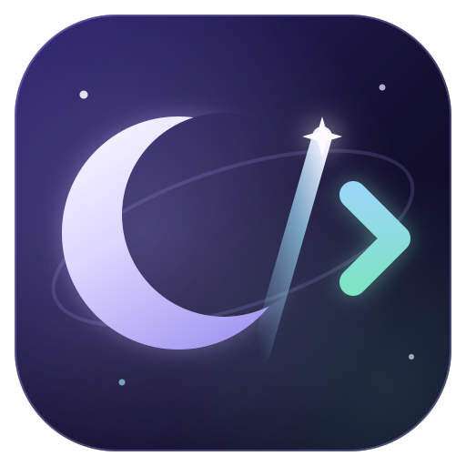
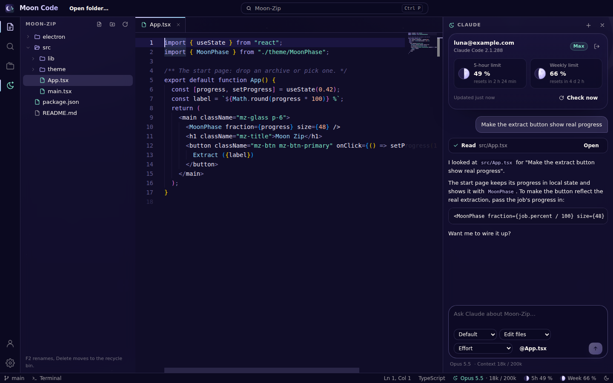
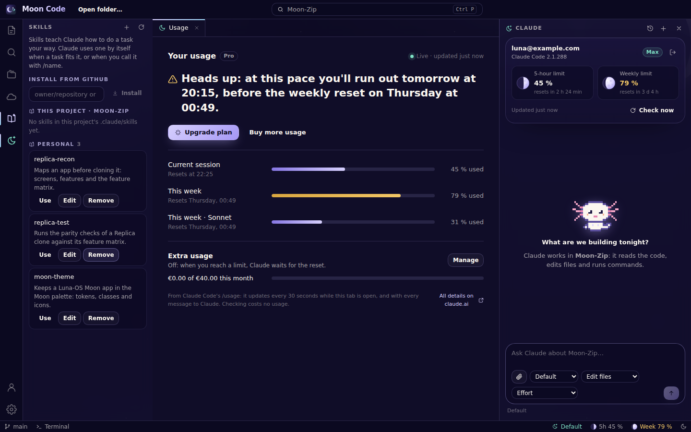
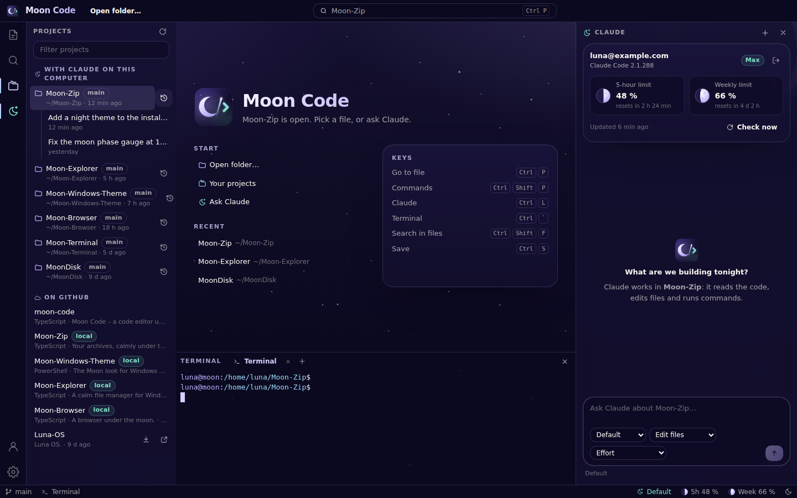
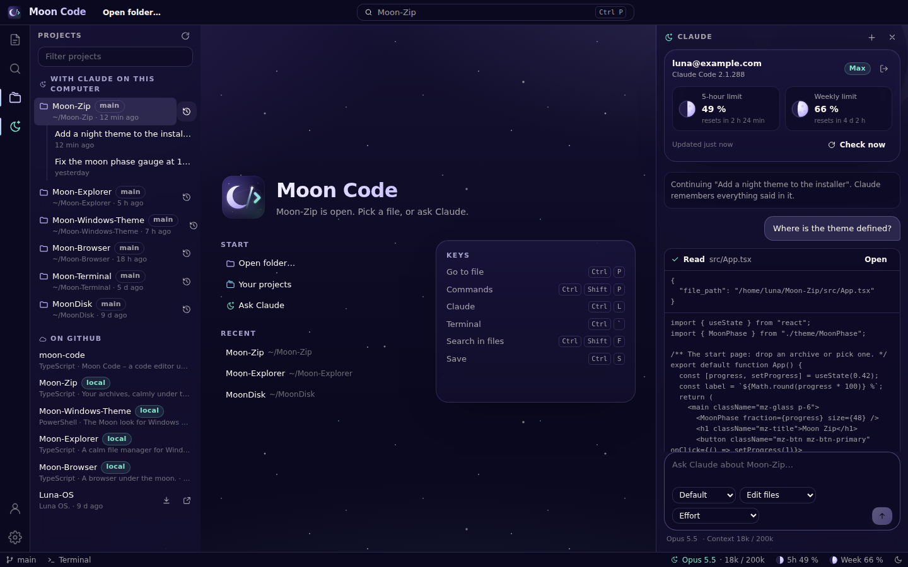
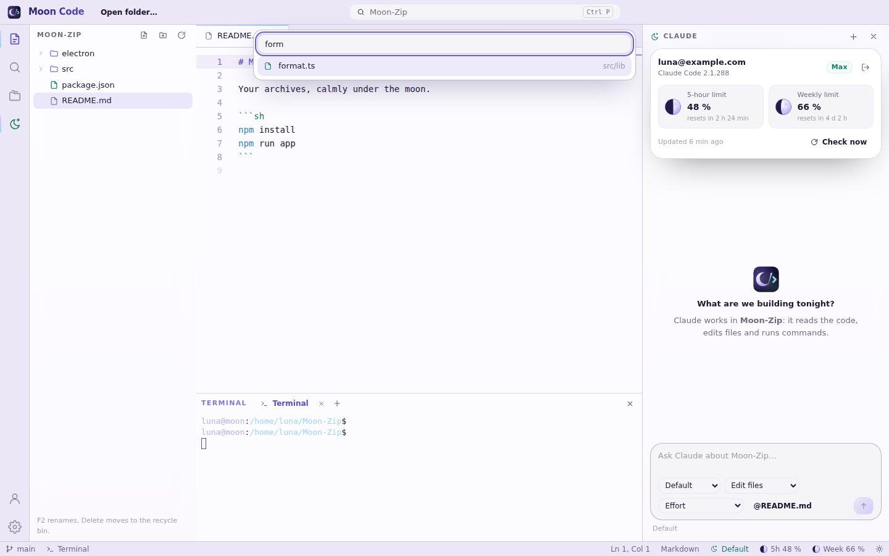

# Moon Code



Moon Code – a code editor under the night sky, with Claude Code built in. Part of the Luna-OS
"Moon" family (Moon Zip, Moon Explorer, MoonTask, MoonDisk, Moon Browser, Moon Terminal): the same
night-sky palette, glass surfaces and moon-phase gauges, around Monaco – the open-source editor
component from Microsoft – and your own Claude Code.



## What it does

- **Edits code**: a file tree (new, rename with F2, delete to the recycle bin), tabs with unsaved
  markers, Monaco with syntax highlighting for 80+ languages, bracket pairs, sticky scroll and a
  minimap, all in the Moon colours (`moon-night` and `moon-day`).
- **Finds things**: go to file (Ctrl+P), the command palette (Ctrl+Shift+P) and search across the
  folder with case, whole-word and regex options (Ctrl+Shift+F).
- **Runs things**: terminals in the bottom panel (Ctrl+\`), PowerShell on Windows.
- **Works with Claude** (Ctrl+L): sign in with your Claude account, then Claude reads, edits and
  runs the code in the open folder. The panel shows **who is signed in, your plan, the model, how
  full the conversation is and how much of your 5-hour and weekly limits is used** – as two moons
  that fill up. Pick the model, the permissions and the effort; allow a blocked command with one
  click. See [docs/claude.md](docs/claude.md).
- **Claude Code on the web, built in**: the cloud icon opens claude.ai/code as a tab of Moon Code –
  drawn in the Moon colours, without browser buttons, signed in once. Session links from
  `claude --cloud` in the terminal open there too.
- **Usage, live**: a Usage tab like the Claude app's – session, week, per model, extra usage and
  a warning when your pace runs out before a reset – that updates by itself. The account menu has
  everything else from the Claude app: Claude's language, help, upgrading, the apps, an API key.
- **Skills**: see, make and install Claude Code skills (also straight from a GitHub repository)
  and call one in the chat with "Use".
- **Pictures and files**: give Claude screenshots, PDFs or any file with the paperclip, by
  dropping them on the message box, or by pasting.
- **Signs in to GitHub** through the GitHub CLI (`gh auth login` in a terminal tab, offered to be
  installed if it's missing): your avatar and account in Projects, your private
  repositories in Projects.
- **Has Axo**: a white pixel axolotl in the Claude panel. It sleeps until you sign in, blinks while
  it waits, types on its moon laptop – with mint code sparks – while Claude works (and says what
  Claude is doing), and cheers when Claude is done. It types in the status bar too.

  

- **Knows your projects**: as soon as you are signed in, **Projects** lists every folder you have
  worked on with Claude Code, with its conversations (pick one to continue it), and your GitHub
  repositories, which clone and open with a click.
- **Updates itself**: Settings → Updates checks GitHub for a new Moon Code, downloads it in the
  background and installs it on "Restart and update". See [docs/updates.md](docs/updates.md).
- **Night and day** themes (or follow Windows). See [docs/theme.md](docs/theme.md).

| Usage and skills | Projects and the terminal | Continuing a conversation | Day theme |
| --- | --- | --- | --- |
|  |  |  |  |

## Run it

You need [Node.js](https://nodejs.org) 22 and, for Claude, [Claude Code](https://code.claude.com)
(Moon Code offers to install it).

```sh
npm install
npm run app          # build the UI and start the app
npm run app:dev      # the same with the Vite dev server and hot reload
```

## Package it

```sh
npm run dist
```

This writes `release/Moon-Code-Setup-<version>.exe` (per-user installer, Start menu and desktop
shortcut) and `release/Moon-Code-<version>-win-x64.zip` (portable). `npm run icons` re-renders
`build/icon.png` and `build/icon.ico` from `public/moon-code-logo.svg`.

## Development

```sh
npm run dev        # the UI alone in a browser (http://localhost:1420), on an in-memory demo
npm run build      # typecheck + production build
npm test           # vitest (UI) and node --test (main process)
npm run lint
```

How the pieces fit together:

- `electron/main.cjs` – the window and the IPC bridge (`electron/preload.cjs`);
  `electron/updater.cjs` – updates from the GitHub releases.
- `electron/workspace.cjs` – files, quick-open list, search, git branch.
- `electron/terminal.cjs` – terminals (node-pty).
- `electron/claude/` – finding and running Claude Code: `cli.cjs` (command lines), `chat.cjs` (one
  process per conversation), `events.cjs` (its stream-json output → UI events), `account.cjs`,
  `projects.cjs`; `electron/github.cjs` is the GitHub account (through `gh`), its repositories
  and cloning; `electron/programs.cjs` finds `claude` and `gh`.
- `src/` – the React UI: `App.tsx` (the workbench), `src/workbench/*` (the views, the editor, the
  Claude panel, the cloud), `src/mascot/*` (Axo; its frames come from
  `scripts/axolotl-frames.py`), `src/theme/*` (the Moon tokens, icons, editor theme), `src/lib/demo.ts` (an
  in-memory main process for the browser and the tests).

## Skills

This repository carries the [Replica skill pack](https://github.com/Jakeschincariol/replica-skill)
(MIT) in `.claude/skills/`, so Claude Code has `/replica-recon`, `/replica-diff`, `/replica-brand`
and the rest whenever it works here. Moon Code's own recon map and feature matrix are in
`replica/` (parity 87/100, all must-haves done).

## License

MIT – see [LICENSE](LICENSE). Monaco Editor and xterm.js are MIT licensed; Claude Code is
Anthropic's and is installed and signed in to by you.
