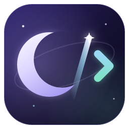

# The Moon theme

Moon Code wears the same "night sky" look as the other Luna-OS Moon apps (Moon Zip, Moon Explorer,
MoonTask, MoonDisk, Moon Browser, Moon Terminal and the Moon Windows theme). It takes the theme over
from [Moon Zip](https://github.com/Luna-OS/Moon-Zip), value for value.

**Source of truth in this repo:** [`src/theme/tokens.css`](../src/theme/tokens.css).

## What is shared

- the stack: React 19 + Vite + Tailwind CSS v4, configured CSS-first through `@theme`
- the `@theme` palette (`night-950 #0b0920`, `night-900 #141030`, `night-800 #1d1742`,
  `violet-700 #3b2e6b`, `lavender-400 #b9aefb`, `lavender-300 #d6cffd`, `moon-100 #f4f1ff`,
  `mint-400 #7fe3c6`, `sky-300 #9ad7f5`, `peach-300 #f7b89a`, `cream-100 #fbf7f0`,
  `warning-400 #f3c766`, `error-500 #e5626b`)
- the two-layer token model, here with the `mc` prefix (`--mc-bg`, `--mc-text`, `--mc-accent`, …)
- night as the default, the day theme through `<html data-theme="light">`, and "follow the system"
- the decorative sky (two star layers, the crescent top right), the glass surfaces, the lavender
  gradient title, the MoonPhase gauge, the 2px round-stroke icons
- the components `.mc-glass`, `.mc-popover`, `.mc-inset`, `.mc-title`, `.mc-eyebrow`, `.mc-btn`
  (+ variants), `.mc-icon-btn`, `.mc-input`, `.mc-chip`, `.mc-meter`, `.mc-switch`, `.mc-kbd`,
  `.mc-titlebar`, `.mc-menu-item`, `.mc-option`
- the 40px custom title bar with the native window buttons coloured to match (`FRAME_COLORS`)

## New in Moon Code

| Piece | What it is |
| --- | --- |
| The workbench | `.mc-activitybar` / `.mc-activity` (the view buttons, with a lavender-to-sky marker), `.mc-sidebar`, `.mc-tabs` / `.mc-tab` (the open tab has the same gradient on top), `.mc-panel`, `.mc-statusbar`, `.mc-sash` (drag edges that light up lavender). |
| The editor | Monaco with two themes, `moon-night` and `moon-day` (`src/theme/monaco-theme.ts`): lavender keywords, mint strings, sky types and operators, peach numbers, gold constants, faint italic comments, lavender/sky/mint bracket pairs. The editor background is `--mc-editor` (`#100d28` at night). |
| The terminal | xterm.js with the Moon ANSI palette (`src/workbench/TerminalView.tsx`), transparent over the panel. |
| Claude's colour | Mint (`--mc-claude`): the Claude button, its status bar item and the working dot. |
| The plan's limits | Two MoonPhase gauges: the moon fills up as the 5-hour and the weekly limit get used, and turns gold at 75 % and red at 90 % in the label. |
| The chat | `.mc-msg-user` (a lavender bubble), `.mc-msg-assistant`, `.mc-tool` (a card per tool call), `.mc-code`, `.mc-composer`. |

## The icon

The other Moon apps share one tile: a crescent at the top, the app's mark below it (Moon Zip's
golden archive box, Moon Explorer's mint folder). Moon Code's icon keeps the family's night tile but
turns the composition around: **the moon is the mark**. The crescent is the opening bracket of a code
tag, a shooting star is the slash, and a sky-to-mint chevron closes it – `☾/>` – with a faint orbit
behind it. `npm run icons` renders `public/moon-code-logo.svg` into `build/icon.png` and
`build/icon.ico`.

